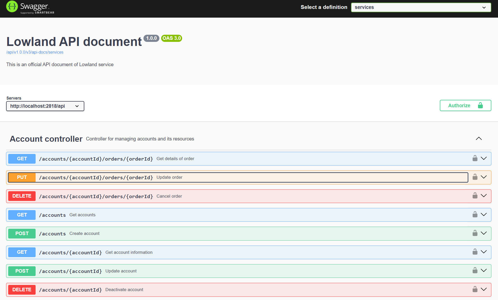
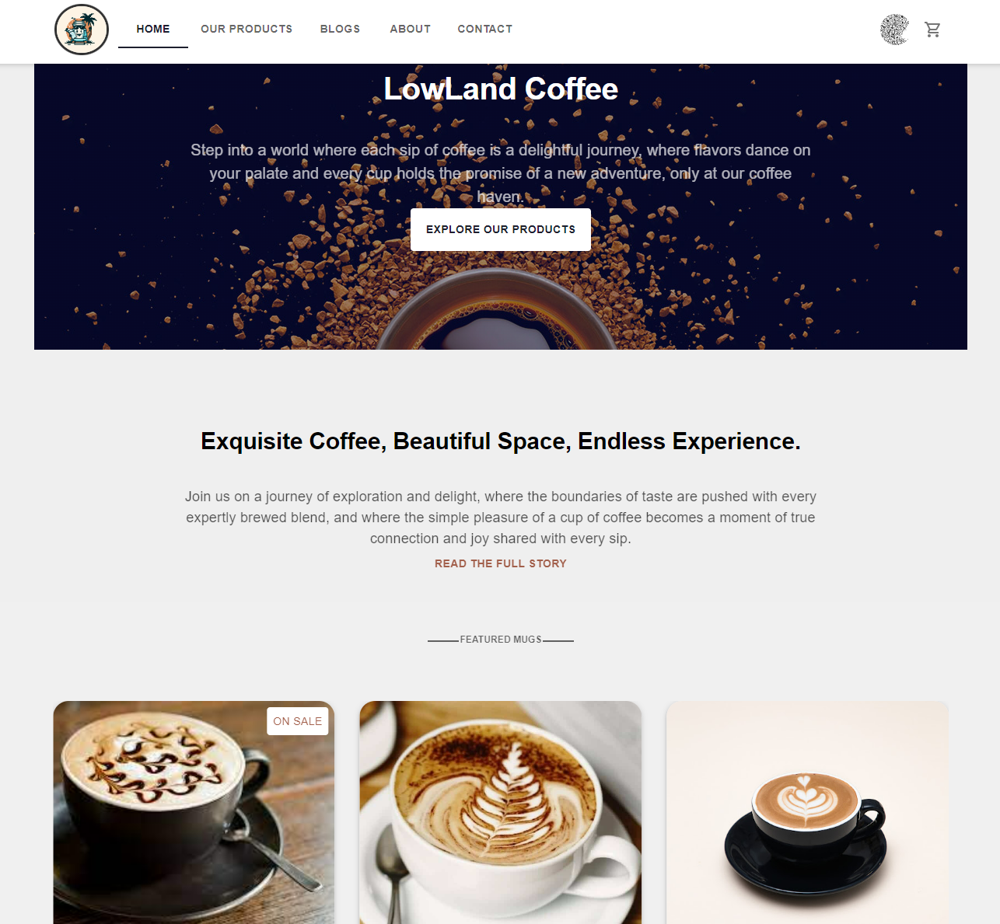
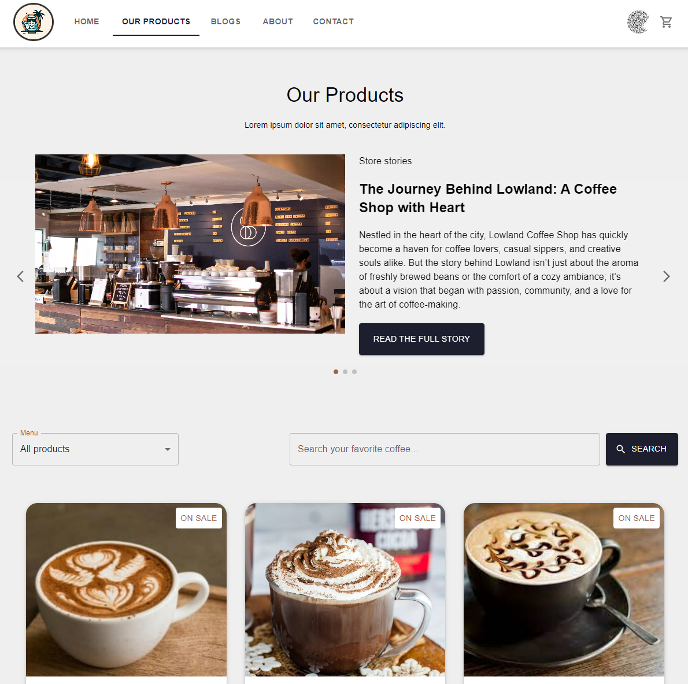
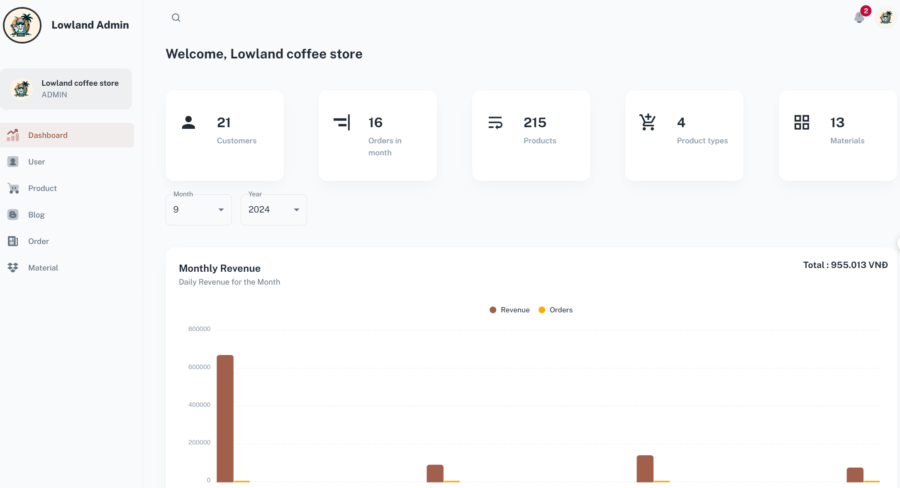

# Lowland Coffee

Lowland Coffee is a project focused on the presentation and management of a coffee shop using Spring Framework & ReactJS (Vite).

## Table of Contents

1. [Overview](#overview)
2. [Key Features](#key-features)
3. [Technologies Used](#technologies-used)
4. [Installation](#installation)
5. [Usage](#usage)
6. [Screenshots](#screenshots)
7. [Contributing](#contributing)
8. [License](#license)
9. [Contact](#contact)
10. [Conclusion](#conclusion)

## Overview

Lowland Coffee is a project focused on the presentation and management of a coffee shop using the Spring Framework and ReactJS (Vite).

## Key Features

### 1. Login and Registration

- **Email & Password Login**: Users can log in securely using their email and password.
- **Google Login**: Quick login with Google to provide a smooth user experience.
- **User Registration**: Register a new account to start using the platform.

### 2. Personal Information Management

- **Edit Profile**: Users can view and update their personal details, including name, email, and profile picture.
- **Contact Information**: Manage personal contact information and update passwords when needed.

### 3. Shopping and Order Management

- **Product Browsing**: Search and add products to the cart for an easy shopping experience.
- **Online Payment via PayOS**: Integrate with PayOS for secure and efficient online payment processing.
- **Order History**: View previous orders and track their status conveniently.

### 4. View and Interact with Posts

- **Blog Posts**: Explore posts related to products, news, or other topics of interest.
- **Comment and Like**: Engage by commenting, liking, and sharing posts to enhance user interaction.
- **Discussion Management**: Easily follow discussions through the comments section.

### 5. Article Management

- **Create and Edit Articles**: Administrators can create and modify blog posts to share information and updates.
- **Delete Articles**: Remove outdated or irrelevant content to keep the blog fresh and relevant.

### 6. User Account Management

- **Manage User Accounts**: Administrators can view, edit, and deactivate user accounts as needed.

### 7. Product Management

- **Add, Edit, and Delete Products**: Manage the product catalog, including adding new products and updating existing ones.
- **Product Categories**: Organize products into categories for easier browsing.

### 8. Ingredient Management

- **Manage Ingredients**: Track and manage the ingredients used in products, ensuring inventory is up-to-date.
- **Supply Tracking**: Monitor ingredient supplies and receive alerts when stocks are low.

### 9. Sales Reporting and Analytics

- **Generate Sales Reports**: Create detailed sales reports to analyze revenue, profit margins, and sales trends over time.
- **View Business Performance Analytics**: Access analytics dashboards to visualize business metrics including web traffic, customer engagement, order volume, product popularity, and materials.

## Technologies Used

- **Frontend**: ReactJS, Material-UI, React Router, Redux Toolkit, TanStack Query.
- **Backend**: Spring Framework, MySQL, MongoDB.
- **Containerization**: Docker.

## Installation

To set up the project locally using Docker, follow these steps:

1. **Clone the repository:**

   ```bash
   git clone https://github.com/quanndb/LowLand.git
   ```

2. **Navigate to the project directory:**

   ```bash
   cd LowLand
   ```

3. **Ensure Docker is installed and running on your machine, and that you have filled in the environment variables in the `docker-compose.yaml` file. Then, build and run the containers using Docker Compose:**

   ```bash
   docker-compose up --build
   ```

4. **Once the services are up and running, you can access the application at:**

   - **Client Interface**: `http://localhost:5173`
   - **Admin Interface**: `http://localhost:5174`

   You can log in using the email `lowland` and the password `lowland`.

### You might also want to explore:

- [API Documentation](http://localhost:2818/api/v1.0.0/api-docs): Access the REST API documentation for all the services.

## Usage

### Docker Management

- **To start the containers:**

  ```bash
  docker-compose up
  ```

- **To stop the containers:**
  ```bash
  docker-compose down
  ```

## Screenshots

<table>
    <thead>
        <tr>
            <th>Backoffice &amp; Storefront</th>
            <th>Observability</th>
        </tr>
    </thead>
    <tbody>
        <tr valign="top">
            <td>
                
                
                
            </td>
            <td>
                
                
            </td>
        </tr>
    </tbody>
</table>

## Contributing

Contributions are welcome! To contribute:

1. Fork the repository.
2. Create a new branch (`git checkout -b feature/YourFeature`).
3. Commit your changes (`git commit -m 'Add feature'`).
4. Push to the branch (`git push origin feature/YourFeature`).
5. Open a Pull Request.

Thank you for contributing to our project!

## License

This project is licensed under the MIT License - see the `LICENSE` file for details.

## Contact

If you have any questions, feedback, or inquiries regarding the project, please reach out to the respective project maintainers based on their areas of responsibility:

- **Project Leader**: [Vu Minh Quan](mailto:quanvuminh28@gmail.com)
- **Front-end Developer**: [Nguyen Anh Quan](mailto:assassjin1@gmail.com)
- **Back-end Developer**: [Le Minh Khoi](mailto:lmk205@gmail.com)

## Conclusion

Thank you for exploring our project. We hope this documentation has provided you with a clear understanding of our application and its components.

If you have any questions, suggestions, or contributions, please don't hesitate to reach out to us through the contact details provided. Your feedback is invaluable in helping us improve and enhance the project.

We appreciate your interest and support. Happy exploring!

Best regards,  
Development Team
